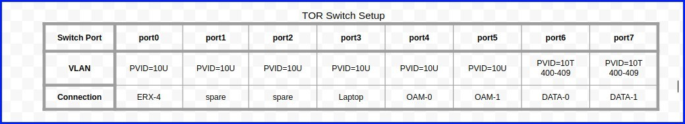
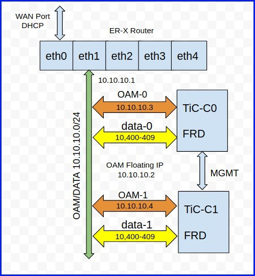

# This is a Work in PROGRESS!! Please use only as general Guideline

# Intel Fog Reference Platform setup for Titanium R4 Duplex, ARC Demo
__Richard Moore, richard.moore@windriver.com, Feb, 2018 (based on instructions from David Mercado, david.mercado@windriver.com)__

This document contains the configuration details for the Intel FRPs used in the ARC demo, February 2018.

## Network and Switch Setup
This is the Network and switch configuration used and referred. Please adjust for your own network situation.
Note that a small router has been used to allow connection to various WAN networks without needing to reconfigure the Titanium OAM and Data networks.

The router used here is a Ubiquiti Edgemax ER-X, but almost any router would do. The TOR (top-of-rack) Switch is an 8-port GBE VLAN switch (such as Netgear,etc) configured like this:



The overall network looks like this:




[TODO] Finish documenting the installation details

## Intel Fog Reference Server Setup
[TODO] Details required for FRP
BIOS Settings
- SATA
- PXE Boot
- Boot Order
 

## Controller-0 Installation
[TODO] Details required for FRP
- Power On
- Boot from prepared USB Titanium image
- allow installer to complete (login prompt appears)
- Copy license.lic file, scripts, config_file and patches from USB
- Patch Installation

Upload the patches into the patching system:
```   
$ sudo sw-patch upload-dir /home/wrsroot
```
Verify status of patches
```
$ sudo sw-patch query
```
Apply the patches
```
$ sudo sw-patch apply --all
```
Install the patches
```
$ sudo sw-patch install-local
```
Reboot the server when prompted
```
$ sudo reboot
```

## Execute config_controller:
Edit the config.ini file to match your system, network, etc and run config_controller.
```
$ sudo config_controller --config-file config.ini
```

Expected Result:
- Execution of 'sudo ifconfig' verifies that OAM and MGMT interfaces
  have valid IPs assigned to them (e.g., MGMT: 192.168.202.3,
  OAM : 10.10.10.3)
- Ability to log into Horizon via 10.10.10.2 or 3
- Ability to SSH into controller-0 via wrsroot@110.10.10.2 or 3

## Run setup Scripts 

### Open a SSH session to controller-0 and setup the OpenStack environment:
```
$ source /etc/nova/openrc
```

### Execute the following scripts to setup the provider and tentant networks, and associated virtual router:
```
$ ./01-configure-provider-network.sh
$ ./02-configure-data-interface.sh
$ ./03-configure-tenant-networks.sh
$ ./04-configure-virtual-routers.sh
```

Expected Results:
- "Horizon -> Admin -> Platform -> Provider Networks" shows "physnet0" provider network.
- "Horizon -> Admin -> Platform -> Host Inventory -> controller-0 ->
  Interfaces tab" shows "data0" assigned as a data network.
- "Horizon -> Admin -> System -> Networks" shows external/internal networks.
- "Horizon -> Admin -> System -> Routers" shows "vrouter0" virtual router.

### Execute `05-setup-nova-local-storage.sh script`. This will setup the 'nova-local' storage on on /dev/sdc of controller-0.
```
$ ./05-setup-nova-local-storage.sh
```

Expected Results:
- Horizon -> Platform -> Host Inventory -> controller-0 -> Storage tab shows nova-local storage state as "adding (on unlock)"

### Add basic flavors to the system:
```
$ ./06-create-basic-flavors.sh
```
Expected Results:
- Flavors can be seen under "Horizon -> Admin -> System -> Flavors"

### Complete configuration of controller-0:
```
$ system compute-config-complete
```
Expected Results: 
- The command returns immediately
- The VGA console (or iDRAC console) displays manifests being applied.  
- The controller reboots after it completes applying the manifests.


## Controller-1 Installation

### Open console to controller-1 via HDMI monitor. Power up controller-1, and enter temporary boot menu <F??> to PXE boot when presented with the F-key options.

Expected Results: 
- controller-1 successfully boots over PXE with the "waiting for personality" message.

### Start SSH session to controller-0 and assign controller-1 its personality:
```
$ source /etc/nova/openrc
$ ./07-assign-controller-1-personality.sh
```

Expected Results:
- controller-1 displays "CPE install" on its console and begins
  installing Titanium Server software.
- controller-1 eventually reboots after software installation completes,
  and the login prompt is seen on the VGA or iDRAC console.
- Ability to ping controller-1 from controller-0 via the MGMT interface,
  and vice versa.

  From controller-0 console:

  $ ping controller-1 -c 1
  PING controller-1 (192.168.204.4) 56(84) bytes of data
  64 bytes from controller-1 (192.168.204.4): icmp_seq=1 ttl=64 time=0.122 ms

  From controller-1 console (you will have to log in as wrsroot/wrsroot
  and change the password first):

  $ ping controller-0 -c 1
  PING controller-0 (192.168.204.3) 56(84) bytes of data
  64 bytes from controller-0 (192.168.204.3): icmp_seq=1 ttl=64 time=0.122 ms


### From the controller-0 SSH session, setup the network interfaces on controller-1 with the following script:
```
$ ./08-setup-controller-1-interfaces.sh
```
Expected Results: 
- "Horizon -> Platform -> Host Inventory -> controller-1 -> Interfaces
  tab" shows interface settings identical to those shown for controller-0

### From the controller-0 SSH session, setup the cinder and nova-local storage on controller-1 with the following script:
```
$ ./09-setup-controller-1-storage.sh
```
Expected Results:
- Horizon -> Platform -> Host Inventory -> controller-1 -> Storage
  tab shows row with cinder UUID and nova-local storage status
  "adding (on unlock)".

### Unlock controller-1, via the controller-0 SSH session:
```
$ system host-unlock controller-1
```
Expected Results:
- On the controller-1 console, you should see the server reboot
- Upon reboot, you should see manifests being applied (will take
  several minutes)
- controller-1 console eventually gets to its login prompt.

### Confirm status of both controllers. From the controller-0 SSH session:
```
$ system host-list
```
Expected Results:
- Both controllers show "Unlocked / Enabled / Available"..
- Use the 'drbd-overview' command to confirm DRBD sync is in progress.
- When DRBD sync completes, verify no critical alarms are shown under
  "Horizon -> Platform -> Fault Management"