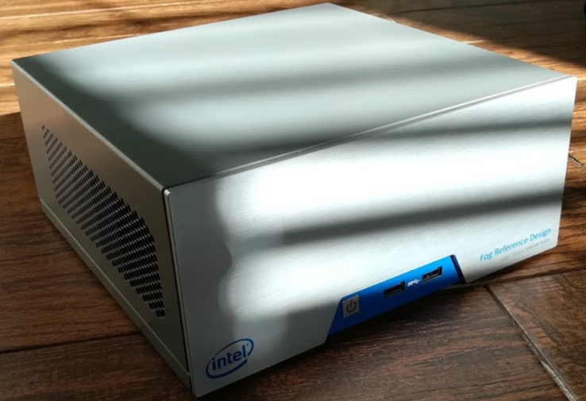
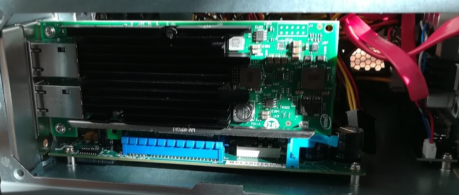
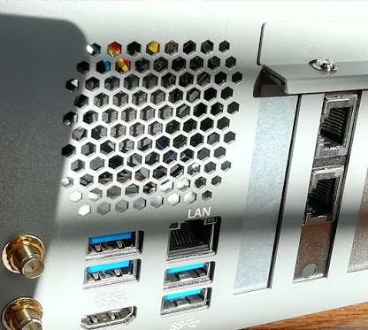
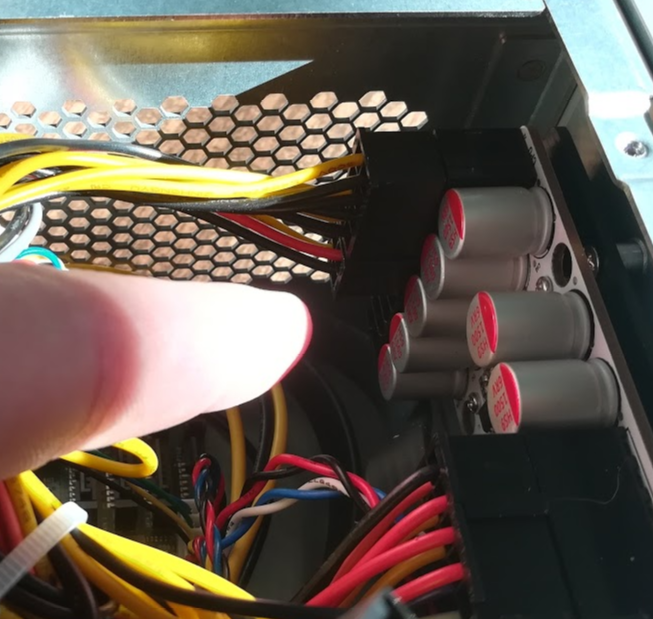
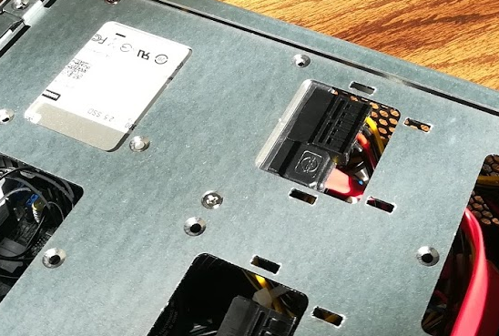
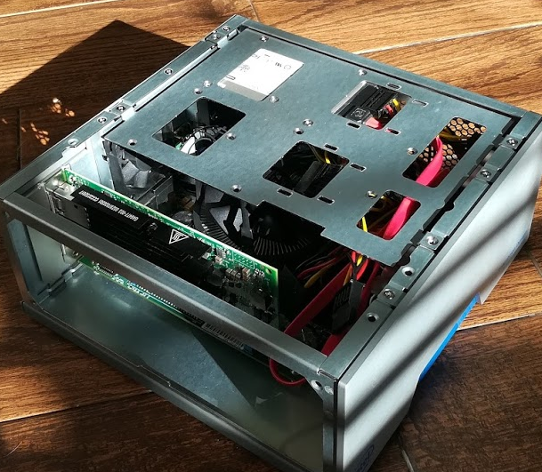
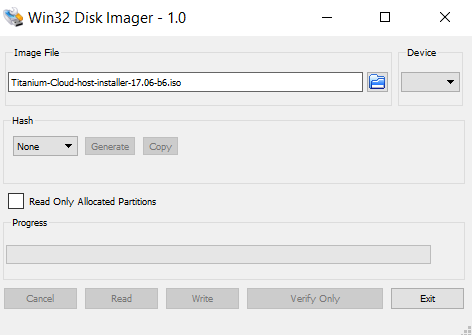
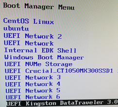
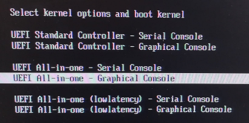

# Wind River&reg; Titanium Cloud on the Intel&reg; Edge Compute (Fog) Reference Design platform - Simplex




### Intel&reg; Fog Reference Design (FRD) platform Specifications

- Intel® Xeon® processor-E3

- 2x8 PCIe

- C236 (server chipset)

- 32GB DDR4 ECC

- WiFi BT M.2 module

- M.2 PCIe x2 SSD

- 4 SATA

- 6 USB

- AMT/VPro/TXT

- TPM2.0, PTT

- Arduino off FPGA

- 3G/4G on PCIe

  ​


### Hardware required to install Titanium Cloud on the FRD

- Fog Reference Design (FRD) platform

- What we are currently using - Intel X540T2 Converged Network Adapt T2 - [Amazon](https://www.amazon.com/Intel-X540T2-Converged-Network-Adapt/dp/B0077CS9UM/)

- 1 x Crucial MX500 1TB 3D NAND SATA 2.5 Inch Internal SSD - [Amazon](https://www.amazon.com/Crucial-MX500-NAND-SATA-Internal/dp/B077SF8KMG/)

- 1 x Crucial MX500 2TB 3D NAND SATA 2.5 Inch Internal SSD - [Amazon](https://www.amazon.com/Crucial-MX500-NAND-SATA-Internal/dp/B078C515QL/)

- VLAN capable switch - Example on Amazon

- Any SATA 6Gbps Cable - Example on [Amazon](https://www.amazon.com/Monoprice-108782-18-Inch-6Gbps-Locking/dp/B009GUX8YK/)

- Any USB 3.0 Flash Drive - Example on [Amazon](https://www.amazon.com/Samsung-METAL-Flash-MUF-32BA-AM/dp/B013CCTM2E/)

- Future - Recommended by network team - Intel Ethernet Converged Network Adapter X710-T4 - [Amazon](https://www.amazon.com/Intel-Ethernet-Converged-Network-Adapter/dp/B01M0XXAWP/)

  ​


### Other Prerequisites

- license.lic - You will need a license file from Wind River to install Titanium Controller
- [config](https://github.com/ctowen/titanium-frd/tree/master/config) folder including answer files, scripts and patches
- USB stick with Titanium Control Release 4 installer
- Titanium Control Release 4 patches 0001 through 0010 (highly recommended)


### Hardware Configuration

Install the Network Adapter into PCI Slot 2 to avoid the adapter hitting the capacitors at the end of Slot 1.






Install the SSD by attaching the SATA cable to the SSD and SATA 0.  In order to power the SDD, you must use the power adapter that came with the FRD.  This power adapter connects to the backplane of the power supply inside the FRD.  See the pictures below.




The SSD can mount on the underside of the upper rack:




The platform should look something like this when you have added the Network Adapter and the SSD:




### Get Wind River Titanium Cloud Software

You can either get access to the latest software through your Wind River representative or if you have Windshare access you can obtain it there.

Log into https://windshare.windriver.com/ with your Wind River account.  If you don't have account then

TODO - how does one get an account?


Download the lasted version of Titanium Cloud as well as the license file.  If you do not have access to a license file, contact your Wind River representative.  You will need it to complete this guide.

### Copy Wind River Titanium to USB Flash Drive

In Windows you can use Win32 Disk Imager to write the ISO to the USB flash drive:




In Linux you can use dd to write the image to a USB Flash drive similar to the following:

```
sudo dd if=Titanium-Cloud-host-installer-XX.XX-XX.iso of=/dev/sdX bs=4m && sync
```

Where /dev/sdX is the USB Flash drive.

### Boot Install from the USB Flash Drive

Connect a Monitor, USB Keyboard and the FRD Power Supply.

Insert the USB Flash Drive into one of the front USB ports on the FRD.  Turn on the power.

During the power on memory test, press the F2 key repeatedly in order to get into the Boot Menu.  Select the Boot Menu then highlight your USB drive and UEFI boot it.



The following selection will install using the graphical console to /dev/sda which will be mapped to the 1TB SSD we installed:



Monitor the installation until it is complete.  Remove the USB Flash Drive to ensure that the system boots from the SSD.

Log into the host as wrsroot, with password wrsroot.

The first time you log in as wrsroot, you are required to change your password.  For the kit we are using the default password **Wrs20!7cto**

```
Changing password for wrsroot.
(current) UNIX Password:
```

Enter the current password (wrsroot).

```
New password:
```

Enter a new password for the wrsroot account.

```Copy the License  TODO - we need to figure out the licensing - how do they get it?  Copy the Titanium Cloud license file to /home/wrsroot/license.lic on the controller.
Retype new password:
```

### Copy Files to FRD

There are several files on [github](https://github.com/ctowen/titanium-frd/tree/master/config) that are needed to perform the Install.  These files include the following:

| File/Folder            | Purpose                                                      |
| ---------------------- | ------------------------------------------------------------ |
| license.lic            | Licensing information                                        |
| frp-simplex-config.ini | Configuration files that help to automate the installation   |
| frp-simplex-setup.sh   | Script that does additional network configuration            |
| /patches               | Updates to the Titanium Control software - get these from WindShare |
| /heat                  | Automate the configuration of Guest VMs - TODO: where are these? |

There are several ways to copy these files to your system, however in most cases USB is the easiest.

For a USB drive, use a cp command similar to the following:

```
cp -r /media/sdc/config /home/wrsroot
```

For an OAM network connection, use an scp command similar to the following:

```
scp -r username@sourcehost:sourcepath/config /home/wrsroot
```

If at this time you need networking for SCP, you can use commands similar to the following to configure your IP address.

```
sudo ip addr add 128.224.82.246/23 dev enp0s31f6
sudo ip link set enp0s31f6 up
sudo route add default gw 128.224.82.1 enp031f6
```

### Copy the License

TODO - we need to figure out the licensing - how do they get it?

Ensure the Titanium Cloud license file has been copied to /home/wrsroot/license.lic on the controller.

### Applying Patches

***Warning: For this guide only Titanium Control Release 4 patches 0001 through 0010 are highly recommended.***

To ensure that the Titanium Cloud software is fully up to date, apply any patches immediately after initializing controller-0 with software.

1. Upload the patches to the patch storage area.

  ```
  $ sudo sw-patch upload-dir /home/wrsroot/patches
  ```

2. Verify patches 0001 through 0010 available.

  ```
  sudo sw-patch query
  ```

3. Apply the patches.

  ```
  $ sudo sw-patch apply --all
  ```

4. Install the patches locally.

  ```
  $ sudo sw-patch install-local
  ```

  This command applies and installs all applied patches on controller-0.

  **WARNING: You must run sw-patch install-local from the controller-0 console. If you run it from an SSH connection, the script fails, and to recover, you must re-install the Titanium Cloud software.**

  NOTE: You must reboot the controller to ensure that it is running with the software fully patched.

5. Execute the following command to reboot controller-0.

  ```
  $ sudo reboot
  ```

  Patch installation is complete.


### Configure controller-0

1. Run the following command to initiate the controller configuration.

   ```
   $ sudo config_controller --config-file /home/wrsroot/frp-simplex-config.ini
   ```

   **WARNING: You must run config_controller from the controller-0 console.**

   The frp-simplex-config.ini configures a common setup including OAM addresses.  This also assumes FRP is behind a firewall so the addresses don't need to change.

2. Execute the following command to reboot controller-0.

   ```
   $ sudo reboot
   ```

   Configuration is complete.

### Copy Images and Verify State

1. Create directory in /opt/backups/images because the images are too large for home directory

   ```
   sudo mkdir /opt/backups/images
   sudo chmod 777 /opt/backups/images
   ```

2. Copy the following files to /opt/backups/images

   Ubuntu-14.04-Cloud.qcow2 from https://cloud-images.ubuntu.com/xenial/current/xenial-server-cloudimg-amd64-disk1.img

   TODO: How do they create Ubuntu-14.04-Cloud.qcow2 from xenial-server-cloudimg-amd64-disk1.img?

   Windows-Server-2012.qcow2 from https://cloudbase.it/windows-cloud-images/#download

   TODO: Do they have to be named exactly Ubuntu-14.04-Cloud.qcow2 and Windows-Server-2012.qcow2?

3. Verify system is in unlocked-enabled-degraded state

   TODO: what are they looking for?

   ```
   source /etc/nova/openrc
   system host-list
   ```

   For standard FRP setup

### Run the Networking Configuration Script

The script allows a configuration file to be used that overrides some defaults like the networks addresses and whether to load images or create volumes.  To use it, just add –f <filename> to the command line. 

Example in hudson-overrides.cfg (OAM/external, 10 GbE NIC PCIe address, and whether to load images or create volumes)

1. Run the Network Configuration Script

   ```
   ./frp-simplex-setup.sh
   ```

2. When script stops and warns that compute-config-complete is required

   ```
   source /etc/nova/openrc
   system compute-config-complete
   ```

3. Wait for FRP to reboot and reach the available state

   ```
   source /etc/nova/openrc
   system host-list
   ```

4. Run the Network Configuration Script Again.  The setup script is designed to be run multiple times.   The procedure requires it twice, once before compute-config-complete and once after.  The script can be run as many times as you want to and it will not redo things you have already done unless you delete something.  For example if you delete the images, volumes, networks, providernets, or router it will recreate them.  The script logs commands and results to a log file.

   ```
   ./frp-simplex-setup.sh
   ```

5. Setup is now complete


TODO:

- Standardize what wrsroot password will be
- What set of networks should be standard
  - Currently created external and one public and one internal network for admin tenant
- Should there be any preinstalled tenants or tenant networks?
- Need to decide on OAM IP, subnet, default route
  - Currently assume Rich's settings will be used behind a firewall for every FRP
- What is best way to copy the files needed to the FRP?
  - scp files, rsync, scp tarball and extract, USB stick
  - Total is currently about 15 GB (mostly images)
- Do we need to specify NTP for a simplex (what if not reachable)
- Are there any heat templates to create?
  - Currently none
- For more automation, consider running setup script using remote CLI
- Configuring Provider Networks at Installation - shell script
- Provisioning Controller-0 - shell script
- Host Install - Ubuntu and Windows Server - Heat templates
- Can we use cloud base for initial configuration of the windows VM?  Heat templates from Rich...
- OpenVPN server???? for remote troubleshooting?
- 2TB - 1TB - 256/512GB NVMe
- GitGo or GoGit replicated on titanium so they have the documentation?


